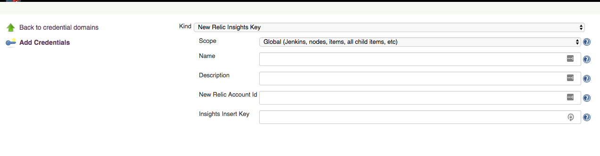
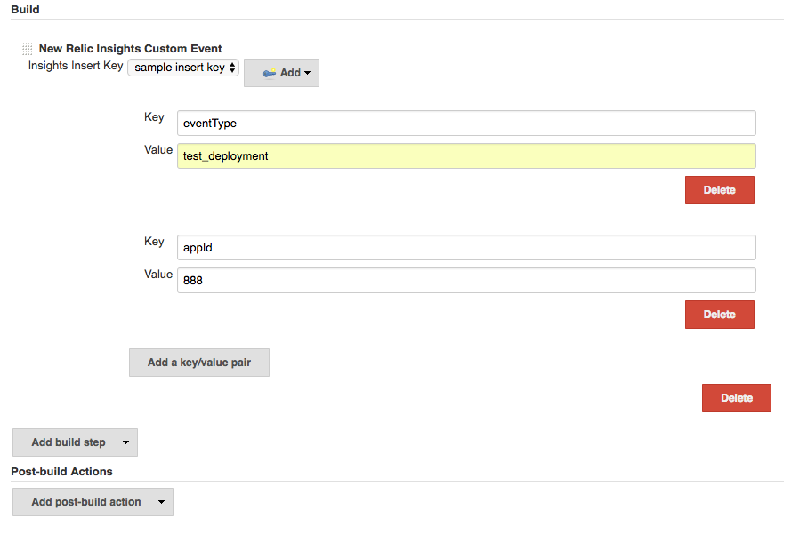
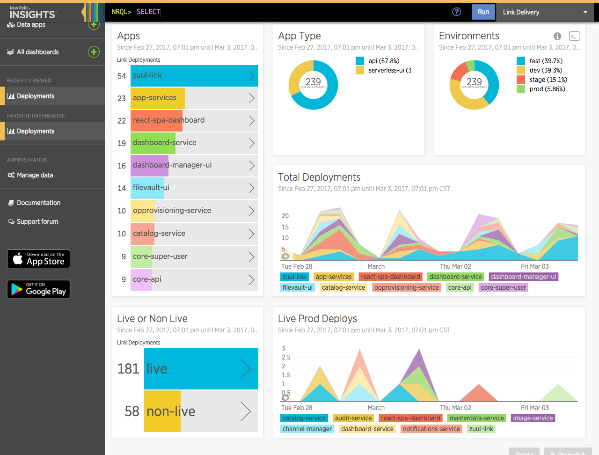

# jenkins-newrelic-insights

This is a Jenkins Plugin which allows users to send custom events to new relic insights.

## Usage

Set up a new relic insights credential in jenkins

Configure freestyle job

- eventType key is required

## Examples

Deployment Metrics

For more information, please see [new relic insights](https://newrelic.com/insights).

## Development

### Maven Tasks

Here is a list of maven tasks that I use on this project:

* **mvn verify**: runs all tests
* **mvn package**: creates the `hpi` plugin archive to be used with Jenkins
* **mvn hpi:run -Djetty.port=8090**: runs the Jenkins server (with the plugin pre-loaded) on port 8090

## License

This project is distributed under the MIT license.

## TODO

- [ ] Seperate out eventType from generic data object
- [ ] Support variables in freestyle
- [ ] Support pipeline
- [ ] Surface a cleaner way to pass the data via pipeline

## Reference credit

https://github.com/jenkinsci/newrelic-deployment-notifier-plugin
 